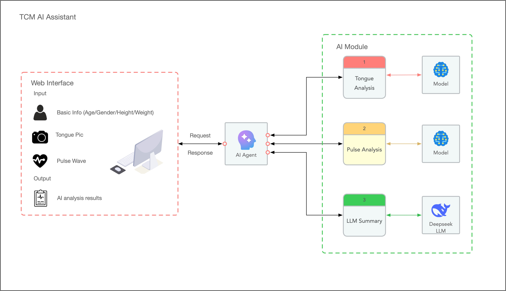

# TCM AI Assistant · 岐黄智诊

> Traditional Chinese Medicine diagnosis assistant — 中医智能辨证助手
> _Combining tongue observation, pulse analysis and AI-assisted pattern differentiation._

**Languages:** [English](#english) · [中文](#中文)

---

## English

### Architecture

### 

### Project structure

```
code/
├── web/              React + Vite single-page app (Chinese / English bilingual UI)
├── api/              FastAPI service exposing the endpoints consumed by the web app
├── ai-agent/         AI agent that synthesises patient info, tongue and pulse results
│                     into a TCM pattern differentiation
├── tongue/  Model training & inference for tongue images
├── pulse/   Model training & inference for pulse waveforms, predict SBP/DBP 
├── docker-compose.yml
├── .venv/            Local Python 3.10 virtualenv (created by the developer)
└── README.md
```

Module responsibilities:

| Module            | Role                                                                                                                      |
|-------------------|---------------------------------------------------------------------------------------------------------------------------|
| `web`             | Four-step UI: patient info → tongue photo → pulse capture → AI diagnosis. Traditional Chinese styling, Chinese & English. |
| `api`             | FastAPI HTTP layer. Validates input, stores sessions, returns bilingual analyses.                                         |
| `ai-agent`        | Orchestrates LLM + retrieval to produce the final pattern report (planned).                                               |
| `tongue` | Vision model for tongue body / coating / shape (planned).                                                                 |
| `pulse`  | Signal-processing & prediction of SBP/DBP.                                                                                |

### Quick start — Docker

Requires Docker Desktop (or any recent `docker` + `docker compose`).

```bash
docker compose up --build   # first time, or after dep changes
docker compose up           # subsequent runs
docker compose down         # stop and remove containers
```

Once both containers report ready:

- Web UI — <http://localhost:5173>
- API root — <http://localhost:8000>
- Swagger UI — <http://localhost:8000/docs> (see [Interactive API documentation](#interactive-api-documentation-swagger--openapi))

The web service proxies `/api/*` to the api service over the internal compose network, so you only need to open the web URL. Source code is bind-mounted, so editing files on the host triggers live reload in both containers.

### Manual setup (without Docker)

Requires **Python 3.10**, **Node.js 18+** and **npm**.

**1. Create the Python virtual environment** (one-time):

```bash
python3.10 -m venv .venv
source .venv/bin/activate
pip install -r requirements.txt
```

**2. Start the API** (terminal 1):

```bash
./api/run.sh
# or:
.venv/bin/python -m uvicorn app.main:app --reload --app-dir api --host 0.0.0.0 --port 8000
```

**3. Start the web app** (terminal 2):

```bash
cd web
npm install        # first time
npm run dev
```

Open <http://localhost:5173>. Vite's dev server proxies `/api/*` to the FastAPI server on port 8000.

### API endpoints (summary)

| Method | Path                                  | Purpose                                       |
|--------|---------------------------------------|-----------------------------------------------|
| GET    | `/api/health`                         | Liveness check                                |
| POST   | `/api/sessions`                       | Create a diagnosis session with patient info  |
| POST   | `/api/sessions/{id}/tongue`           | Upload tongue image, returns mock analysis    |
| POST   | `/api/sessions/{id}/pulse`            | Submit pulse capture, returns mock analysis   |
| POST   | `/api/sessions/{id}/diagnose`         | Generate the final pattern report             |
| GET    | `/api/sessions/{id}`                  | Inspect the full session state                |

All user-facing strings are returned as `{ "zh": "...", "en": "..." }`. The web app picks the field for the active locale via `pickLang`.

### Interactive API documentation (Swagger / OpenAPI)

The API is fully described as an OpenAPI 3.1 spec, with tagged endpoints, request/response examples and inline schema descriptions.

| Path             | Tool        | What it is                                                                 |
|------------------|-------------|----------------------------------------------------------------------------|
| `/`              | redirect    | Bounces straight to Swagger UI.                                            |
| `/docs`          | Swagger UI  | Browse endpoints and use **Try it out** to call them straight from the browser. |
| `/redoc`         | ReDoc       | Reference-style three-column layout, good for reading.                     |
| `/openapi.json`  | spec        | Raw OpenAPI document — feed it to Postman, code generators, etc.           |

Once the API is running:

```bash
open http://localhost:8000/docs    # macOS — or just visit it in the browser
```

Endpoints are grouped by tag (`Health` · `Sessions` · `Tongue` · `Pulse` · `Diagnose`) and every request and response model carries a worked example, so **Try it out** pre-fills sensible values for clicking through the whole four-step flow.

### Pulse analysis — dataset preprocessing

The `pulse/` module ships with a small pipeline that turns the raw [UCI Cuff-Less Blood Pressure Estimation](https://archive.ics.uci.edu/dataset/340/cuff+less+blood+pressure+estimation) records into model-ready PPG windows with SBP / DBP labels.

**Source data.** The dataset is distributed as MATLAB v7.3 `.mat` files (`Part_1.mat` … `Part_4.mat`), each a cell array of variable-length records. Every record is an `(N, 3)` matrix sampled at 125 Hz, where the three channels are:

| Channel | Signal | Description                                                       |
|---------|--------|-------------------------------------------------------------------|
| 0       | PPG    | Photoplethysmogram from the fingertip — used as the model input   |
| 1       | ABP    | Invasive arterial blood pressure (mmHg) — source of SBP / DBP labels |
| 2       | ECG    | Channel-II electrocardiogram (not used downstream)                |

Download the four parts and place them under `pulse/dataset/`:

```
pulse/dataset/
├── Part_1.mat
├── Part_2.mat
├── Part_3.mat
└── Part_4.mat
```

**Scripts.** Everything lives in `pulse/preprocess/`:

| Script              | Purpose                                                                                                  |
|---------------------|----------------------------------------------------------------------------------------------------------|
| `data_inspect.py`   | Open one `.mat` file and print the shape / duration of the first record. Useful as a sanity check.       |
| `data_visualize.py` | Plot PPG / ABP / ECG of the first record into `plot.png`.                                                |
| `build_dataset.py`  | Slice every record into fixed-length windows, filter out artefacts, normalise, and write `train.npz` / `val.npz` / `test.npz`. |

**Pipeline (`build_dataset.py`).**

1. **Sliding window** — each record is cut into `WINDOW_SIZE = 256` samples (≈ 2.048 s at 125 Hz) with `STRIDE = 128` (50 % overlap). 256 is a power of two, which is convenient for downstream conv / FFT layers.
2. **Filtering** — windows are dropped if:
   - any sample in the PPG or ABP window is `NaN`;
   - the PPG signal is too flat (`std < 1e-3`), which usually means a sensor drop-out;
   - the derived SBP is outside `[50, 250]` mmHg or DBP is outside `[30, 150]` mmHg (physiologically implausible).
3. **Labelling** — SBP is the per-window maximum of ABP, DBP the per-window minimum.
4. **Normalisation** — each PPG window is z-score normalised (zero mean, unit variance) so absolute sensor gain does not leak into the model.
5. **Reshape** — PPG windows become `(256, 1)` so they can be stacked into `(N, 256, 1)` tensors.
6. **Split** — windows are split 80 / 10 / 10 into train / val / test with a fixed `random_state=42` for reproducibility.

**Outputs.** Three NumPy archives are written to `pulse/dataset/`:

| File         | Keys                  | Shape                                |
|--------------|-----------------------|--------------------------------------|
| `train.npz`  | `ppg`, `sbp`, `dbp`   | `(N, 256, 1)`, `(N, 1)`, `(N, 1)` — 80 % of windows |
| `val.npz`    | `ppg`, `sbp`, `dbp`   | same shape — 10 % of windows         |
| `test.npz`   | `ppg`, `sbp`, `dbp`   | same shape — 10 % of windows         |

**Running it.**

```bash
# from the repo root, with the .venv active
pip install h5py numpy scikit-learn matplotlib

cd pulse/preprocess

python data_inspect.py      # optional — print record shape / duration
python data_visualize.py    # optional — write plot.png of one record
python build_dataset.py     # produces train.npz / val.npz / test.npz
```

The scripts reference `../dataset/` with relative paths, so they must be run from inside `pulse/preprocess/`.

### Pulse analysis — model training

`pulse/train.py` trains a 1D-CNN regressor that maps a 256-sample PPG window to a `(SBP, DBP)` pair.

**Model** — `pulse/models/cnn1d.py` defines a three-block 1D-CNN:

| Block | Layer                                  | Output channels |
|-------|----------------------------------------|-----------------|
| 1     | `Conv1d(1→32, k=5, pad=2)` + BN + ReLU + MaxPool(2)  | 32 |
| 2     | `Conv1d(32→64, k=5, pad=2)` + BN + ReLU + MaxPool(2) | 64 |
| 3     | `Conv1d(64→128, k=5, pad=2)` + BN + ReLU + AdaptiveAvgPool(1) | 128 |
| Head  | `Flatten → Linear(128→64) → ReLU → Linear(64→2)`     | 2 (SBP, DBP) |

Input shape is `(B, 256, 1)`; the model permutes to `(B, 1, 256)` internally before the conv stack.

**Training setup** — defined inline in `train.py`:

| Setting       | Value                                            |
|---------------|--------------------------------------------------|
| Loss          | `SmoothL1Loss` (Huber) — robust against BP label outliers |
| Optimizer     | `Adam`, `lr = 1e-3`                              |
| Batch size    | `2048`                                           |
| Epochs        | `30`                                             |
| Device        | CUDA if available, else CPU (auto-detected)      |
| Best-model    | Saved to `best_model.pth` whenever val loss improves |

**Console output** — `train.py` is heavily instrumented so you can see progress live:

- Startup banner: device / GPU name, train + val sample counts, batches, batch size.
- Per-batch line: `loss`, `mae`, running averages, batch time in ms, elapsed time within the epoch — for **both** train and val phases.
- End-of-epoch summary: train/val loss + MAE, then a timing line with `train`, `val`, `epoch`, cumulative `total`, and `eta` for the remaining epochs.
- Best-model save line including the achieving `val_loss`.
- Final line: total wall-clock training time and best val loss.

**Reference run** — on the dataset preprocessed by `build_dataset.py`, 30 epochs took ~44 min and reached:

```
Epoch 30/30 done  train_loss=8.6882 train_mae=9.17  |  val_loss=10.5998 val_mae=11.09
  time: train=0:01:21  val=0:00:06  epoch=0:01:27  total=0:43:55  eta=0:00:00
```

**Running it.**

```bash
# from the repo root, with the .venv active
pip install torch numpy scikit-learn

cd pulse
python train.py
```

The script loads `./dataset/train.npz` and `./dataset/val.npz` (relative paths), so it must be run from inside `pulse/`. The trained `best_model.pth` is written next to the script.

### Pulse analysis — prediction

`pulse/predict.py` wraps the trained checkpoint behind a single `BloodPressurePredictor` class so the API / agent code does not need to know about PyTorch.

**Usage:**

```python
from predict import BloodPressurePredictor

predictor = BloodPressurePredictor(model_path="best_model.pth")
sbp, dbp = predictor.predict(ppg)        # ppg: 1-D array-like of 256 samples @125 Hz
print(f"Predicted SBP: {sbp:.2f}")
print(f"Predicted DBP: {dbp:.2f}")
```

**What the class does:**

| Step               | Detail                                                                 |
|--------------------|------------------------------------------------------------------------|
| Device selection   | `cuda` if available, otherwise `cpu`. Can be overridden via the `device` kwarg. |
| Model loading      | Instantiates `CNN1D`, loads `state_dict` from `model_path`, switches to `eval()`. |
| `preprocess(ppg)`  | Casts to `float32`, z-score normalises with the same `+1e-8` epsilon as training, reshapes `(256,) → (256, 1) → (1, 256, 1)`. |
| `predict(ppg)`     | Runs the model under `torch.no_grad()` and returns two Python floats `(sbp, dbp)` in mmHg. |

**Important:** the input window must be **256 samples at 125 Hz** (≈ 2.048 s) — the same shape used during preprocessing and training. Different lengths will fail at the convolution stage.


### Tongue analysis — overview

`tongue/` contains a YOLO-based tongue-image analyser. It detects classical tongue features (white coating, cracked tongue, dentate tongue, etc.) and produces health-risk hints via a rule engine in `tongue/coco/tongue_label_profiles.json`.

| Item              | Location                                                       |
|-------------------|----------------------------------------------------------------|
| Training script   | `tongue/train_yolo.py`                                         |
| Single-image CLI  | `tongue/coco/predict_tongue_disease.py`                        |
| Bytes → JSON      | `tongue/predict_result_from_bytes.py` (called from the API)    |
| Standalone API    | `tongue/coco/tongue_disease_api.py`                            |
| Dataset YAML      | `tongue/coco/shezhenv3_coco_dataset.yaml`                      |
| Label rules       | `tongue/coco/tongue_label_profiles.json`                       |
| Model checkpoint  | `tongue/weights/best.pt`                                       |

See [`tongue/README.md`](tongue/README.md) for the full dataset / training / inference walkthrough.

### Tongue analysis — API integration

`POST /api/sessions/{id}/tongue` is wired to the real YOLO model through `api/app/tongue_predictor.py`. The flow:

1. The uploaded image bytes are passed to `tongue.predict_result_from_bytes.generate_predict_result_json_from_bytes(...)`, which spawns the YOLO predictor as a subprocess and returns a JSON string.
2. `tongue_analysis_from_json(result_str)` parses that JSON, splits every concatenated bilingual string (e.g. `"白苔舌White coating tongue"`) into a `BilingualText({zh, en})`, and maps it into the typed `TongueAnalysis` model.
3. On any failure (predictor crash, malformed JSON, missing weights) the endpoint falls back to `mock_data.mock_tongue_analysis(...)` so the four-step demo flow keeps working. The log line `[upload_tongue] source={model|mock}` shows which path each request took.

The bilingual-string splitter (`split_zh_en`) is a small heuristic: it locates the first Latin letter in the source string and treats everything before as `zh`, everything from that index onwards as `en`. Works on both short labels (`"齿痕舌Dentate tongue"`) and full sentences whose Chinese ends with `。` followed by an English sentence.

**Response shape** (`TongueAnalysis`):

```json
{
  "detected_labels": [
    {"name": {"zh": "白苔舌", "en": "White coating tongue"}, "count": 1},
    {"name": {"zh": "裂纹舌", "en": "Cracked tongue"},        "count": 1},
    {"name": {"zh": "齿痕舌", "en": "Dentate tongue"},        "count": 2}
  ],
  "possible_disease_or_health_risks": [
    {"risk": {"zh": "津液不足风险", "en": "Risk of Insufficient Body Fluids"}, "score": 1.135}
  ],
  "detections": [
    {
      "class_id": 9,
      "label": "baitaishe",
      "name": {"zh": "白苔舌", "en": "White coating tongue"},
      "confidence": 0.8637,
      "meaning": {
        "zh": "舌苔偏白，常作为寒湿、脾胃功能偏弱或早期外感的观察信号。",
        "en": "A white coating on the tongue is often seen as a sign of cold-dampness, weak spleen function, or early external contraction."
      },
      "possible_risks": [
        {"zh": "寒湿风险",         "en": "Risk of Cold-Dampness"},
        {"zh": "脾胃功能偏弱风险", "en": "Risk of Weak Spleen Function"}
      ]
    }
  ]
}
```

Every user-facing string follows the project's `{zh, en}` convention so the frontend's `pickLang` helper renders the right language without an extra round-trip.

### Disclaimer

This project is for **research and educational purposes only**. The AI output does **not** constitute a medical diagnosis. Always consult a licensed TCM practitioner.

---

## 中文

### 架构


### 项目结构

```
code/
├── web/              React + Vite 单页面应用（中英双语界面）
├── api/              FastAPI 服务，向 web 端提供所需接口
├── ai-agent/         智能体：根据基本信息、舌象与脉象生成中医辨证报告
├── tongue/  舌象图像模型的训练与推理
├── pulse/   脉象信号的训练与推理，预测舒张压和收缩压
├── docker-compose.yml
├── .venv/            本地 Python 3.10 虚拟环境（开发者自行创建）
└── README.md
```

模块职责：

| 模块               | 说明                                             |
|--------------------|------------------------------------------------|
| `web`              | 四步式问诊界面：基本信息 → 舌象采集 → 脉象采集 → 智能辨证。古典中医风格，中英双语。 |
| `api`              | FastAPI 接口层，校验请求、维护会话、返回中英双语的辨证数据。             |
| `ai-agent`         | 调度 LLM 与知识检索，输出综合辨证报告（规划中）。                    |
| `tongue`  | 舌质、舌苔、舌形的视觉模型（规划中）。                            |
| `pulse`   | 根据脉搏预测心脏的舒张压和收缩压                               |

### 快速启动 — Docker

需要安装 Docker Desktop（或较新版本的 `docker` 与 `docker compose`）。

```bash
docker compose up --build   # 首次构建，或依赖变更后
docker compose up           # 之后可直接启动
docker compose down         # 关闭并移除容器
```

待两个容器就绪后：

- 网页 — <http://localhost:5173>
- API 根路径 — <http://localhost:8000>
- Swagger UI — <http://localhost:8000/docs>（详见[交互式 API 文档](#交互式-api-文档swagger--openapi)）

web 容器通过内部网络将 `/api/*` 转发至 api 容器，所以只需访问网页地址即可。源码以 bind-mount 方式挂载，宿主机上编辑文件即可在两个容器中触发热更新。

### 手动启动（不使用 Docker）

需要 **Python 3.10**、**Node.js 18+** 与 **npm**。

**1. 创建 Python 虚拟环境**（仅首次）：

```bash
python3.10 -m venv .venv
source .venv/bin/activate
pip install -r requirements.txt
```

**2. 启动 API**（终端 1）：

```bash
./api/run.sh
# 或：
.venv/bin/python -m uvicorn app.main:app --reload --app-dir api --host 0.0.0.0 --port 8000
```

**3. 启动 Web 应用**（终端 2）：

```bash
cd web
npm install        # 仅首次
npm run dev
```

浏览器访问 <http://localhost:5173>。Vite 开发服务器会将 `/api/*` 转发到 8000 端口的 FastAPI 服务。

### API 接口一览

| 方法   | 路径                                  | 用途                                           |
|--------|---------------------------------------|------------------------------------------------|
| GET    | `/api/health`                         | 健康检查                                       |
| POST   | `/api/sessions`                       | 创建辨证会话（包含基本信息）                   |
| POST   | `/api/sessions/{id}/tongue`           | 上传舌象图片，返回模拟的舌象分析               |
| POST   | `/api/sessions/{id}/pulse`            | 提交脉象采集结果，返回模拟的脉象分析           |
| POST   | `/api/sessions/{id}/diagnose`         | 生成最终辨证报告                               |
| GET    | `/api/sessions/{id}`                  | 查看完整会话信息                               |

所有界面文案以 `{ "zh": "...", "en": "..." }` 的双语形式返回，前端通过 `pickLang` 自动选用当前语言。

### 交互式 API 文档（Swagger / OpenAPI）

API 已完整描述为 OpenAPI 3.1 规范，包含分组标签、示例请求与响应、以及行内字段说明。

| 路径             | 工具         | 说明                                                                       |
|------------------|--------------|----------------------------------------------------------------------------|
| `/`              | 重定向       | 自动跳转到 Swagger UI。                                                    |
| `/docs`          | Swagger UI   | 浏览全部接口，并通过 **Try it out** 在浏览器中直接发起调用。               |
| `/redoc`         | ReDoc        | 三栏式参考文档，更适合阅读。                                              |
| `/openapi.json`  | 原始规范     | OpenAPI 文档原文，可直接导入 Postman、代码生成器等工具。                  |

API 启动后：

```bash
open http://localhost:8000/docs    # macOS — 或直接在浏览器打开
```

接口按标签分组（`Health` · `Sessions` · `Tongue` · `Pulse` · `Diagnose`），每个请求与响应模型都附带示例值，**Try it out** 会自动填入合理参数，可一路点击体验完整的四步流程。

### 脉象分析 — 数据集预处理

`pulse/` 模块附带一套完整的预处理流水线，将公开数据集 [UCI Cuff-Less Blood Pressure Estimation](https://archive.ics.uci.edu/dataset/340/cuff+less+blood+pressure+estimation) 中的原始记录，转换为带有 SBP / DBP 标签、可直接喂给模型的 PPG 信号窗口。

**原始数据。** 数据集以 MATLAB v7.3 的 `.mat` 文件形式发布（`Part_1.mat` … `Part_4.mat`），每个文件是一组长度不等的记录。每条记录为 `(N, 3)` 矩阵，采样率为 125 Hz，三个通道分别是：

| 通道 | 信号 | 说明                                                     |
|------|------|----------------------------------------------------------|
| 0    | PPG  | 指尖光电容积描记信号 — 作为模型输入                      |
| 1    | ABP  | 有创动脉血压（mmHg）— 用于生成 SBP / DBP 标签            |
| 2    | ECG  | II 导联心电（本流程暂不使用）                            |

下载四个 part，放到 `pulse/dataset/` 目录下：

```
pulse/dataset/
├── Part_1.mat
├── Part_2.mat
├── Part_3.mat
└── Part_4.mat
```

**脚本说明。** 所有脚本都位于 `pulse/preprocess/`：

| 脚本                | 作用                                                                                |
|---------------------|-------------------------------------------------------------------------------------|
| `data_inspect.py`   | 打开任意 `.mat` 文件，打印首条记录的形状与时长，用于数据自检。                      |
| `data_visualize.py` | 将首条记录的 PPG / ABP / ECG 三个通道画到 `plot.png` 中，便于直观确认信号质量。     |
| `build_dataset.py`  | 滑窗切片、伪迹过滤、归一化，并写出 `train.npz` / `val.npz` / `test.npz`。            |

**处理流程（`build_dataset.py`）。**

1. **滑动窗口** — 每条记录按 `WINDOW_SIZE = 256` 个采样点（125 Hz 下约为 2.048 秒）切片，步长 `STRIDE = 128`（重叠 50 %）。256 为 2 的幂次，对后续的卷积 / FFT 计算更友好。
2. **数据过滤** — 满足以下任一条件的窗口将被丢弃：
   - PPG 或 ABP 窗口内含有 `NaN`；
   - PPG 信号过于平坦（`std < 1e-3`），通常表示传感器掉信；
   - 推导出的 SBP 不在 `[50, 250]` mmHg、或 DBP 不在 `[30, 150]` mmHg 的生理合理范围内。
3. **标签生成** — SBP 取窗口内 ABP 的最大值，DBP 取最小值。
4. **归一化** — 每个 PPG 窗口做 Z-score 归一化（零均值、单位方差），避免传感器增益差异污染模型。
5. **形状调整** — PPG 窗口扩展为 `(256, 1)`，便于堆叠为 `(N, 256, 1)` 的张量。
6. **数据集划分** — 全部窗口按 80 % / 10 % / 10 % 划分为 train / val / test，使用固定的 `random_state=42` 保证可复现。

**输出文件。** 在 `pulse/dataset/` 下生成三份 NumPy 归档：

| 文件         | 字段                  | 形状                                                |
|--------------|-----------------------|-----------------------------------------------------|
| `train.npz`  | `ppg`、`sbp`、`dbp`   | `(N, 256, 1)`、`(N, 1)`、`(N, 1)` — 占总窗口 80 %  |
| `val.npz`    | `ppg`、`sbp`、`dbp`   | 同上 — 占总窗口 10 %                               |
| `test.npz`   | `ppg`、`sbp`、`dbp`   | 同上 — 占总窗口 10 %                               |

**运行方式。**

```bash
# 在仓库根目录下，激活 .venv
pip install h5py numpy scikit-learn matplotlib

cd pulse/preprocess

python data_inspect.py      # 可选：打印记录形状与时长
python data_visualize.py    # 可选：生成 plot.png，可视化首条记录
python build_dataset.py     # 生成 train.npz / val.npz / test.npz
```

脚本中使用 `../dataset/` 的相对路径，必须在 `pulse/preprocess/` 目录下运行。

### 脉象分析 — 模型训练

`pulse/train.py` 训练一个 1D-CNN 回归模型，将 256 个采样点的 PPG 窗口映射到 `(SBP, DBP)` 一对血压值。

**模型结构** — 定义在 `pulse/models/cnn1d.py`，由三个 1D-CNN 模块组成：

| 模块  | 网络层                                                        | 输出通道 |
|-------|---------------------------------------------------------------|----------|
| 1     | `Conv1d(1→32, k=5, pad=2)` + BN + ReLU + MaxPool(2)            | 32       |
| 2     | `Conv1d(32→64, k=5, pad=2)` + BN + ReLU + MaxPool(2)           | 64       |
| 3     | `Conv1d(64→128, k=5, pad=2)` + BN + ReLU + AdaptiveAvgPool(1)  | 128      |
| 输出头 | `Flatten → Linear(128→64) → ReLU → Linear(64→2)`               | 2（SBP、DBP）|

输入形状为 `(B, 256, 1)`，模型内部会先 permute 为 `(B, 1, 256)` 再进入卷积层。

**训练参数** — 直接写在 `train.py` 中：

| 配置项       | 取值                                                            |
|--------------|-----------------------------------------------------------------|
| 损失函数     | `SmoothL1Loss`（Huber 损失）— 对血压标签中的异常值更稳健          |
| 优化器       | `Adam`，`lr = 1e-3`                                              |
| Batch size   | `2048`                                                           |
| Epochs       | `30`                                                             |
| 设备         | 自动选择 CUDA，无 GPU 时回落到 CPU                               |
| 最优模型     | 验证集损失下降时，自动保存为 `best_model.pth`                    |

**控制台输出** — `train.py` 内置丰富的日志，便于实时观察训练进度：

- 启动横幅：设备 / GPU 名称、训练与验证样本数、batch 数、batch size。
- 每个 batch 一行：`loss`、`mae`、累计平均值、单 batch 耗时（ms）、当前 epoch 已用时间 —— 训练与验证阶段均输出。
- Epoch 结束汇总：训练 / 验证的 loss 与 MAE，以及一行计时：`train`、`val`、`epoch`、累计 `total`、剩余 `eta`。
- 最优模型保存行，附带触发保存时的 `val_loss`。
- 训练结束总耗时与最优 val_loss。

**参考结果** — 在 `build_dataset.py` 处理过的数据集上训练 30 个 epoch，总耗时约 44 分钟：

```
Epoch 30/30 done  train_loss=8.6882 train_mae=9.17  |  val_loss=10.5998 val_mae=11.09
  time: train=0:01:21  val=0:00:06  epoch=0:01:27  total=0:43:55  eta=0:00:00
```

**运行方式。**

```bash
# 在仓库根目录下，激活 .venv
pip install torch numpy scikit-learn

cd pulse
python train.py
```

脚本以相对路径加载 `./dataset/train.npz` 与 `./dataset/val.npz`，需要在 `pulse/` 目录下运行。训练得到的 `best_model.pth` 会写在脚本同级目录。

### 脉象分析 — 推理预测

`pulse/predict.py` 将训练得到的权重封装在 `BloodPressurePredictor` 类中，API / 智能体侧无需了解 PyTorch 细节即可调用。

**使用方式：**

```python
from predict import BloodPressurePredictor

predictor = BloodPressurePredictor(model_path="best_model.pth")
sbp, dbp = predictor.predict(ppg)        # ppg：长度为 256、采样率 125 Hz 的一维序列
print(f"Predicted SBP: {sbp:.2f}")
print(f"Predicted DBP: {dbp:.2f}")
```

**类的主要职责：**

| 步骤              | 说明                                                                                  |
|-------------------|---------------------------------------------------------------------------------------|
| 设备选择          | 默认 `cuda`，无 GPU 时回落到 `cpu`，也可通过 `device` 参数显式指定。                  |
| 模型加载          | 实例化 `CNN1D`，从 `model_path` 加载 `state_dict`，切换到 `eval()` 模式。              |
| `preprocess(ppg)` | 转换为 `float32`、使用与训练相同的 `+1e-8` 容差做 Z-score 归一化，并 reshape 为 `(256,) → (256, 1) → (1, 256, 1)`。 |
| `predict(ppg)`    | 在 `torch.no_grad()` 上下文中执行前向推理，返回两个 Python `float`，单位 mmHg。       |

**注意：** 输入窗口必须为 **125 Hz 下的 256 个采样点**（≈ 2.048 秒），与预处理、训练阶段保持一致；长度不同会在卷积层报错。

### 舌象分析 — 概览

`tongue/` 目录提供基于 YOLO 的舌象图像分析：识别经典舌象特征（白苔舌、裂纹舌、齿痕舌等），并通过规则表 `tongue/coco/tongue_label_profiles.json` 输出健康风险提示。

| 内容             | 路径                                                          |
|------------------|---------------------------------------------------------------|
| 训练脚本         | `tongue/train_yolo.py`                                        |
| 单图推理 CLI     | `tongue/coco/predict_tongue_disease.py`                       |
| bytes → JSON     | `tongue/predict_result_from_bytes.py`（由 API 调用）          |
| 独立 API         | `tongue/coco/tongue_disease_api.py`                           |
| 数据集 YAML      | `tongue/coco/shezhenv3_coco_dataset.yaml`                     |
| 类别 → 提示映射  | `tongue/coco/tongue_label_profiles.json`                      |
| 模型权重         | `tongue/weights/best.pt`                                      |

数据集、训练与推理的完整说明详见 [`tongue/README.md`](tongue/README.md)。

### 舌象分析 — API 集成

`POST /api/sessions/{id}/tongue` 通过 `api/app/tongue_predictor.py` 接入真实的 YOLO 模型，流程如下：

1. 上传的图片 bytes 交由 `tongue.predict_result_from_bytes.generate_predict_result_json_from_bytes(...)` 处理，该函数以子进程方式运行 YOLO 预测脚本，并返回 JSON 字符串。
2. `tongue_analysis_from_json(result_str)` 解析该 JSON，将所有中英拼接的字符串（如 `"白苔舌White coating tongue"`）拆分为 `BilingualText({zh, en})`，最终映射为强类型的 `TongueAnalysis`。
3. 任何环节失败（预测脚本崩溃、JSON 异常、权重缺失等）时，端点会自动回落到 `mock_data.mock_tongue_analysis(...)`，保证四步流程能继续走通。日志 `[upload_tongue] source={model|mock}` 可直观看出每次请求走了哪条路径。

中英拆分函数 `split_zh_en` 采用一个小启发式：定位字符串中**第一个 Latin 字母**的位置，前半视为中文（含中文标点），其后视为英文。短标签（如 `"齿痕舌Dentate tongue"`）与完整句子（中文以 `。` 结尾、其后接英文句子）均能正确切分。

**响应结构**（`TongueAnalysis`）：

```json
{
  "detected_labels": [
    {"name": {"zh": "白苔舌", "en": "White coating tongue"}, "count": 1},
    {"name": {"zh": "裂纹舌", "en": "Cracked tongue"},        "count": 1},
    {"name": {"zh": "齿痕舌", "en": "Dentate tongue"},        "count": 2}
  ],
  "possible_disease_or_health_risks": [
    {"risk": {"zh": "津液不足风险", "en": "Risk of Insufficient Body Fluids"}, "score": 1.135}
  ],
  "detections": [
    {
      "class_id": 9,
      "label": "baitaishe",
      "name": {"zh": "白苔舌", "en": "White coating tongue"},
      "confidence": 0.8637,
      "meaning": {
        "zh": "舌苔偏白，常作为寒湿、脾胃功能偏弱或早期外感的观察信号。",
        "en": "A white coating on the tongue is often seen as a sign of cold-dampness, weak spleen function, or early external contraction."
      },
      "possible_risks": [
        {"zh": "寒湿风险",         "en": "Risk of Cold-Dampness"},
        {"zh": "脾胃功能偏弱风险", "en": "Risk of Weak Spleen Function"}
      ]
    }
  ]
}
```

所有面向用户的文案统一采用 `{zh, en}` 双语结构，前端通过 `pickLang` 即可按当前语言选择字段，无需额外请求。

### 免责声明

本项目仅供**学习与研究**使用，AI 输出**不构成**任何形式的医学诊断。如有健康问题，请咨询执业中医师或正规医疗机构。
